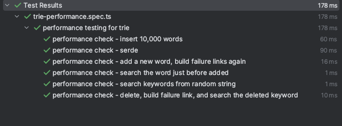

# About
- Tiny, and simple search module based on `trie` and `aho-corasick` using TypeScript. 
- Also, it supports serialization and de-serialization into `string` type.

# Use case
- I made this library for searching keywords my users enrolled from a title of a post without search engine library.
## For me?
- Making trie based on keywords of users
- Save the serialized trie into in memory k-v storage like `Redis`.
- Retrieve the serialized trie from the storage and de-serialize it when.
  - User enrolled new keywords
  - User deleted existed keywords
- Search keywords in a title of a post using de-serialized trie

# Installation
```shell
npm install tynisearch
```

# Benchmark
## TL;DR


## In table
| **Calculation**                              | **Elapsed time (ms)** |
|----------------------------------------------|-----------------------|
| Searching                                    | 1                     |
| Inserting (including building failure links) | 60                    |
| Serialization and de-serialization           | 90                    |
## Dataset Description
- 10,000 words, which consisted of words longer than 5 characters
  - You can see the whole [dataset](tests/dataset.txt)
## Test Description
- You can see the performance test code [here](tests/tynisearch-performance.spec.ts)


# Example
## Insert and delete
```typescript
import { TyniSearch } from 'tynisearch';

const tyniSearch = new TyniSearch();

const words = ["fox", "dog"]
const titleToSearch = "The quick brown fox jumps over the lazy dog";

// insert words as a list
tyniSearch.insert(words);

const result = tyniSearch.searchInSentence(titleToSearch); 
console.log(result); // ["fox", "dog"]

// delete words as a list
tyniSearch.delete(words);

const resultAfterDeletion = tyniSearch.searchInSentence(titleToSearch);
console.log(resultAfterDeletion); // []
```

## Serialization and De-serialization (SerDe)
```typescript
const tyniSearch = new TyniSearch();

const wordList = ["fox", "dog"]
const titleToSearch = "The quick brown fox jumps over the lazy dog";

// insert words as a list
tyniSearch.insert(words);

// serialize to string
const ser = tyniSearch.serialize();

// de-serialize from serialized string
const de = TyniSearch.deserialize(ser);

// search in de-serialized trie
const result = de.serialize(titleToSearch);
console.log(result); // ["fox", "dog"]
```

## Misc.
```typescript
const tyniSearch = new TyniSearch();
const words = ["fox", "dog"]
tyniSearch.insert(words);

// getting the number of all nodes
tyniSearch.getNumberOfNodes(); // 2

// getting all saved keywords in trie
tyniSearch.getAllKeywords(); // ["fox", "dog"]

```

---

# Points should be enhanced
## Can not save failure links in serialization and de-serialization
Because of the circular reference problem, I can not save failure links in serialization and de-serialization. And I think there must be a better way to solve this problem.

You should build failure links using `.buildFailureLinks()` again after de-serialization.

**Or, you can contribute to this project to solve this problem (I really want it!)**

## Calculating the failure links is not efficient
I think it is also better way to calculate failure graph when building failure links. 

Currently, building failure graph is required after every insertion. In other words, you should call `.buildFailureLinks()` before run `searchInSentence(sentence: string)` method after any new words are inserted into.

**Or, you can contribute to this project to solve this problem (I really want it!)(2)**

---

# Contacts
## Email
- pravda.kracota@gmail.com
## github
- https://github.com/prravda
## LinkedIn
- https://www.linkedin.com/in/pravdakracota/